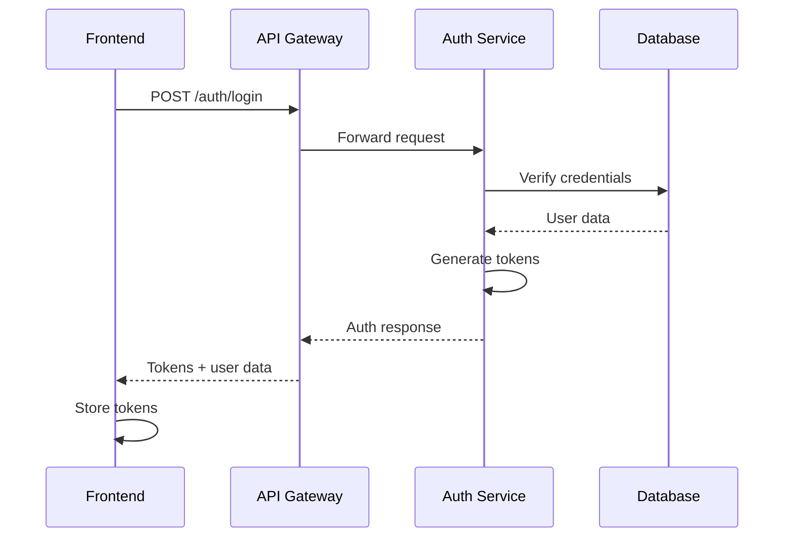
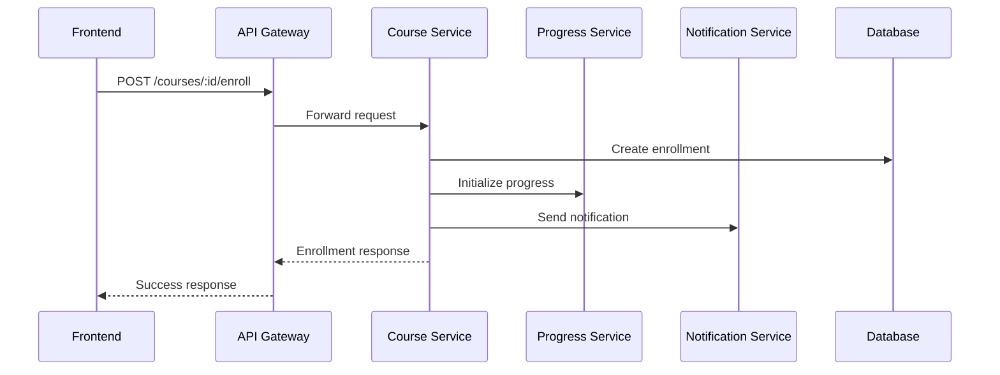
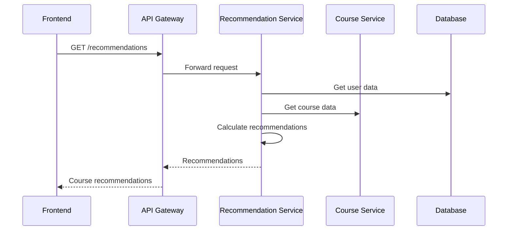

# 📋 Spécifications Techniques - Backend Plateforme Éducative

## 🎯 Vue d'Ensemble Technique

Ce document détaille les spécifications techniques complètes du backend de plateforme éducative, incluant l'architecture, les modèles de données, les APIs et les flux de données.

## 🏗️ Architecture Technique

### Stack Technologique

| Composant | Technologie | Version | Description |
|-----------|-------------|---------|-------------|
| **Runtime** | Node.js | >= 18.0.0 | Environnement d'exécution |
| **Language** | TypeScript | 5.3.3 | Langage de programmation |
| **Framework** | Express.js | 5.1.0 | Framework web |
| **Base de données** | PostgreSQL | 15 | Base de données principale |
| **ORM** | Prisma | 5.22.0 | Object-Relational Mapping |
| **Cache** | Redis | 7 | Cache et sessions |
| **Message Queue** | RabbitMQ | 3.12 | Communication inter-services |
| **Search** | Elasticsearch | 8.12.0 | Moteur de recherche |
| **Document DB** | MongoDB | 7 | Données non structurées |
| **Containerisation** | Docker | Latest | Conteneurisation |
| **Orchestration** | Kubernetes | Latest | Orchestration |

### Architecture Microservices

```
┌─────────────────┐    ┌─────────────────┐    ┌─────────────────┐
│   Frontend      │    │   Mobile App    │    │   Third Party   │
└─────────┬───────┘    └─────────┬───────┘    └─────────┬───────┘
          │                      │                      │
          └──────────────────────┼──────────────────────┘
                                 │
                    ┌─────────────▼─────────────┐
                    │     API Gateway           │
                    │     (Port 3000)           │
                    └─────────────┬─────────────┘
                                  │
        ┌─────────────────────────┼─────────────────────────┐
        │                         │                         │
┌───────▼────────┐    ┌───────────▼──────────┐    ┌────────▼────────┐
│  Auth Service  │    │   User Service       │    │  Course Service │
│  (Port 3001)   │    │   (Port 3002)        │    │  (Port 3003)    │
└───────┬────────┘    └───────────┬──────────┘    └────────┬────────┘
        │                         │                        │
┌───────▼────────┐    ┌───────────▼──────────┐    ┌────────▼────────┐
│  Progress      │    │  Social Service      │    │ Recommendation  │
│  Service       │    │  (Port 3006)         │    │  Service        │
│  (Port 3005)   │    └───────────┬──────────┘    │  (Port 3004)    │
└───────┬────────┘                │               └────────┬────────┘
        │              ┌──────────▼──────────┐              │
        │              │  Notification       │              │
        │              │  Service            │              │
        │              │  (Port 3007)        │              │
        │              └──────────┬──────────┘              │
        │                         │                         │
        └─────────────────────────┼─────────────────────────┘
                                  │
                    ┌─────────────▼─────────────┐
                    │      Shared Services      │
                    │  - Prisma (Database)      │
                    │  - Redis (Cache)          │
                    │  - Elasticsearch (Search) │
                    │  - MongoDB (Documents)    │
                    └───────────────────────────┘
```

## 📊 Modèles de Données

### Schéma Prisma Complet

```prisma
// Modèles principaux
model User {
  id            String    @id @default(uuid())
  email         String    @unique
  password      String
  role          UserRole  @default(STUDENT)
  isActive      Boolean   @default(true)
  createdAt     DateTime  @default(now())
  updatedAt     DateTime  @updatedAt

  // Relations
  profile       Profile?
  courses       Course[]  // Cours créés (instructeur)
  enrollments   Enrollment[]
  skills        UserSkill[]
  achievements  Achievement[]
  interactions  UserInteraction[]
  forumThreads  ForumThread[]
  forumReplies  ForumReply[]
  conversations ConversationParticipant[]
  messages      Message[]
  studyGroups   StudyGroupMember[]
  preferences   UserPreference[]
  reviews       Review[]
}

model Course {
  id            String    @id @default(uuid())
  title         String
  description   String
  thumbnailUrl  String?
  category      String
  level         CourseLevel
  duration      Int       // en minutes
  price         Decimal?
  instructorId  String
  isPublished   Boolean   @default(false)
  createdAt     DateTime  @default(now())
  updatedAt     DateTime  @updatedAt

  // Relations
  instructor    User      @relation(fields: [instructorId], references: [id])
  modules       Module[]
  enrollments   Enrollment[]
  reviews       Review[]
  skills        CourseSkill[]
  prerequisites CoursePrerequisite[]
  prerequisiteFor CoursePrerequisite[] @relation("Prerequisite")
  interactions  UserInteraction[]
  forumThreads  ForumThread[]
  studyGroups   StudyGroup[]
}

model Module {
  id            String    @id @default(uuid())
  courseId      String
  title         String
  description   String?
  order         Int
  
  course        Course    @relation(fields: [courseId], references: [id])
  lessons       Lesson[]
}

model Lesson {
  id            String    @id @default(uuid())
  moduleId      String
  title         String
  description   String?
  videoUrl      String?
  contentUrl    String?
  duration      Int       // en minutes
  order         Int
  
  module        Module    @relation(fields: [moduleId], references: [id])
  progress      LessonProgress[]
  resources     Resource[]
  quiz          Quiz?
}

// Modèles de progression
model Enrollment {
  id            String    @id @default(uuid())
  userId        String
  courseId      String
  enrolledAt    DateTime  @default(now())
  completedAt   DateTime?
  
  user          User      @relation(fields: [userId], references: [id])
  course        Course    @relation(fields: [courseId], references: [id])
  progress      Progress?
  certificate   Certificate?
  
  @@unique([userId, courseId])
}

model Progress {
  id                String    @id @default(uuid())
  enrollmentId      String    @unique
  lastActivityAt    DateTime  @default(now())
  totalTimeSpent    Int       @default(0) // en secondes
  
  enrollment        Enrollment @relation(fields: [enrollmentId], references: [id])
  completedLessons  LessonProgress[]
}

model LessonProgress {
  id            String    @id @default(uuid())
  progressId    String
  lessonId      String
  completedAt   DateTime  @default(now())
  score         Float?
  timeSpent     Int       // en secondes
  
  progress      Progress  @relation(fields: [progressId], references: [id])
  lesson        Lesson    @relation(fields: [lessonId], references: [id])
  
  @@unique([progressId, lessonId])
}

// Modèles sociaux
model StudyGroup {
  id            String    @id @default(uuid())
  name          String
  description   String?
  courseId      String
  maxMembers    Int       @default(10)
  isActive      Boolean   @default(true)
  createdAt     DateTime  @default(now())
  
  course        Course    @relation(fields: [courseId], references: [id])
  members       StudyGroupMember[]
  sessions      StudySession[]
}

model ForumThread {
  id            String    @id @default(uuid())
  courseId      String
  authorId      String
  title         String
  content       String
  tags          String[]
  isPinned      Boolean   @default(false)
  isResolved    Boolean   @default(false)
  viewCount     Int       @default(0)
  createdAt     DateTime  @default(now())
  updatedAt     DateTime  @updatedAt
  
  course        Course    @relation(fields: [courseId], references: [id])
  author        User      @relation(fields: [authorId], references: [id])
  replies       ForumReply[]
}

// Modèles de contenu
model Resource {
  id            String    @id @default(uuid())
  lessonId      String
  title         String
  type          String
  url           String
  description   String?
  createdAt     DateTime  @default(now())
  
  lesson        Lesson    @relation(fields: [lessonId], references: [id])
}

model Quiz {
  id            String    @id @default(uuid())
  lessonId      String    @unique
  title         String
  description   String?
  timeLimit     Int?      // en minutes
  passingScore  Float     @default(70.0)
  createdAt     DateTime  @default(now())
  
  lesson        Lesson    @relation(fields: [lessonId], references: [id])
  questions     QuizQuestion[]
}

// Enums
enum UserRole {
  STUDENT
  TEACHER
  ADMIN
}

enum CourseLevel {
  BEGINNER
  INTERMEDIATE
  ADVANCED
  EXPERT
}

enum InteractionType {
  VIEW
  ENROLL
  COMPLETE_LESSON
  RATE
  BOOKMARK
  SHARE
}

enum GroupRole {
  ADMIN
  MODERATOR
  MEMBER
}

enum QuestionType {
  MULTIPLE_CHOICE
  TRUE_FALSE
  SHORT_ANSWER
  ESSAY
}
```

## 🔌 APIs Détaillées

### 1. Service d'Authentification (Port 3001)

#### Endpoints

| Méthode | Endpoint | Description | Auth Requise |
|---------|----------|-------------|--------------|
| `POST` | `/auth/register` | Inscription utilisateur | Non |
| `POST` | `/auth/login` | Connexion utilisateur | Non |
| `POST` | `/auth/refresh` | Rafraîchir token | Non |
| `POST` | `/auth/logout` | Déconnexion | Oui |
| `GET` | `/auth/verify` | Vérifier token | Oui |
| `GET` | `/health` | Health check | Non |

#### Modèles de Données

```typescript
// Types d'entrée
interface RegisterRequest {
  email: string;
  password: string;
  firstName?: string;
  lastName?: string;
}

interface LoginRequest {
  email: string;
  password: string;
}

interface RefreshRequest {
  refreshToken: string;
}

// Types de réponse
interface AuthResponse {
  message: string;
  user: {
    id: string;
    email: string;
    role: UserRole;
  };
  accessToken: string;
  refreshToken: string;
}

interface VerifyResponse {
  valid: boolean;
  user?: {
    id: string;
    email: string;
    role: UserRole;
  };
}
```

### 2. Service Utilisateur (Port 3002)

#### Endpoints

| Méthode | Endpoint | Description | Auth Requise |
|---------|----------|-------------|--------------|
| `GET` | `/users/profile` | Obtenir profil | Oui |
| `PUT` | `/users/profile` | Mettre à jour profil | Oui |
| `POST` | `/users/avatar` | Upload avatar | Oui |
| `GET` | `/users/skills` | Obtenir compétences | Oui |
| `POST` | `/users/skills` | Ajouter compétence | Oui |
| `GET` | `/health` | Health check | Non |

#### Modèles de Données

```typescript
interface UserProfile {
  id: string;
  email: string;
  role: UserRole;
  profile: {
    firstName?: string;
    lastName?: string;
    avatarUrl?: string;
    bio?: string;
    level: number;
    experience: number;
    learningStyle?: string;
    timeZone: string;
    language: string;
  };
}

interface UpdateProfileRequest {
  firstName?: string;
  lastName?: string;
  bio?: string;
  learningStyle?: string;
  timeZone?: string;
  language?: string;
}
```

### 3. Service Cours (Port 3003)

#### Endpoints

| Méthode | Endpoint | Description | Auth Requise |
|---------|----------|-------------|--------------|
| `GET` | `/courses` | Lister cours | Non |
| `GET` | `/courses/:id` | Obtenir cours | Non |
| `POST` | `/courses` | Créer cours | Oui (TEACHER) |
| `PUT` | `/courses/:id` | Mettre à jour cours | Oui (TEACHER) |
| `DELETE` | `/courses/:id` | Supprimer cours | Oui (TEACHER) |
| `POST` | `/courses/:id/enroll` | S'inscrire | Oui |
| `GET` | `/courses/search` | Rechercher cours | Non |
| `GET` | `/health` | Health check | Non |

#### Modèles de Données

```typescript
interface Course {
  id: string;
  title: string;
  description: string;
  thumbnailUrl?: string;
  category: string;
  level: CourseLevel;
  duration: number;
  price?: number;
  instructor: {
    id: string;
    name: string;
    avatarUrl?: string;
  };
  modules: Module[];
  skills: string[];
  prerequisites: string[];
  rating: number;
  enrollmentCount: number;
  isPublished: boolean;
  createdAt: string;
  updatedAt: string;
}

interface Module {
  id: string;
  title: string;
  description?: string;
  order: number;
  lessons: Lesson[];
}

interface Lesson {
  id: string;
  title: string;
  description?: string;
  videoUrl?: string;
  contentUrl?: string;
  duration: number;
  order: number;
  isCompleted?: boolean;
}
```

### 4. Service Recommandations (Port 3004)

#### Endpoints

| Méthode | Endpoint | Description | Auth Requise |
|---------|----------|-------------|--------------|
| `GET` | `/recommendations` | Obtenir recommandations | Oui |
| `GET` | `/courses/:id/similar` | Cours similaires | Non |
| `POST` | `/interactions` | Enregistrer interaction | Oui |
| `GET` | `/health` | Health check | Non |

#### Modèles de Données

```typescript
interface Recommendation {
  id: string;
  title: string;
  description: string;
  category: string;
  level: CourseLevel;
  rating: number;
  enrollments: number;
  matchScore: number;
  reason: string;
}

interface Interaction {
  courseId: string;
  action: InteractionType;
  duration?: number;
  rating?: number;
}
```

### 5. Service Progrès (Port 3005)

#### Endpoints

| Méthode | Endpoint | Description | Auth Requise |
|---------|----------|-------------|--------------|
| `GET` | `/progress/courses/:id` | Progrès cours | Oui |
| `POST` | `/progress/lessons/:id/complete` | Terminer leçon | Oui |
| `GET` | `/progress/achievements` | Obtenir succès | Oui |
| `GET` | `/health` | Health check | Non |

#### Modèles de Données

```typescript
interface CourseProgress {
  courseId: string;
  courseTitle: string;
  progress: {
    completedLessons: number;
    totalLessons: number;
    percentage: number;
    timeSpent: number;
    lastActivityAt: string;
  };
  lessons: LessonProgress[];
  certificate?: Certificate;
}

interface LessonProgress {
  id: string;
  title: string;
  isCompleted: boolean;
  completedAt?: string;
  score?: number;
  timeSpent: number;
}
```

## 🔄 Flux de Données

### 1. Flux d'Authentification



### 2. Flux d'Inscription à un Cours



### 3. Flux de Recommandations



## 🔒 Sécurité

### 1. Authentification JWT

```typescript
// Structure du token
interface JWTPayload {
  userId: string;
  email: string;
  role: UserRole;
  iat: number;
  exp: number;
}

// Configuration
const JWT_CONFIG = {
  accessToken: {
    secret: process.env.JWT_SECRET,
    expiresIn: '15m'
  },
  refreshToken: {
    secret: process.env.JWT_SECRET,
    expiresIn: '7d'
  }
};
```

### 2. Autorisation par Rôles

```typescript
enum UserRole {
  STUDENT = 'STUDENT',
  TEACHER = 'TEACHER',
  ADMIN = 'ADMIN'
}

// Middleware d'autorisation
const requireRole = (roles: UserRole[]) => {
  return (req: Request, res: Response, next: NextFunction) => {
    if (!roles.includes(req.user.role)) {
      return res.status(403).json({ error: 'Accès refusé' });
    }
    next();
  };
};
```

### 3. Validation des Données

```typescript
// Validation avec express-validator
const validateCourse = [
  body('title').isLength({ min: 3, max: 100 }),
  body('description').isLength({ min: 10, max: 1000 }),
  body('category').isIn(['programming', 'design', 'business']),
  body('level').isIn(['BEGINNER', 'INTERMEDIATE', 'ADVANCED', 'EXPERT']),
  body('duration').isInt({ min: 1 }),
  body('price').optional().isFloat({ min: 0 })
];
```

## 📊 Performance

### 1. Stratégies de Cache

```typescript
// Cache Redis pour les cours populaires
const CACHE_KEYS = {
  COURSE: 'course:',
  COURSE_LIST: 'courses:list:',
  USER_PROFILE: 'user:profile:',
  RECOMMENDATIONS: 'recommendations:'
};

const CACHE_TTL = {
  COURSE: 3600,        // 1 heure
  COURSE_LIST: 1800,   // 30 minutes
  USER_PROFILE: 7200,  // 2 heures
  RECOMMENDATIONS: 900 // 15 minutes
};
```

### 2. Pagination

```typescript
interface PaginationParams {
  page: number;
  limit: number;
  sortBy?: string;
  sortOrder?: 'asc' | 'desc';
}

interface PaginatedResponse<T> {
  data: T[];
  pagination: {
    page: number;
    limit: number;
    total: number;
    totalPages: number;
    hasNext: boolean;
    hasPrev: boolean;
  };
}
```

### 3. Optimisation des Requêtes

```sql
-- Index pour les performances
CREATE INDEX idx_courses_category ON courses(category);
CREATE INDEX idx_courses_level ON courses(level);
CREATE INDEX idx_courses_instructor ON courses(instructor_id);
CREATE INDEX idx_enrollments_user ON enrollments(user_id);
CREATE INDEX idx_progress_enrollment ON progress(enrollment_id);
```

## 🧪 Tests

### 1. Tests Unitaires

```typescript
// Exemple de test Jest
describe('AuthService', () => {
  it('should register a new user', async () => {
    const userData = {
      email: 'test@example.com',
      password: 'password123',
      firstName: 'John',
      lastName: 'Doe'
    };

    const result = await authService.register(userData);
    
    expect(result.user.email).toBe(userData.email);
    expect(result.accessToken).toBeDefined();
    expect(result.refreshToken).toBeDefined();
  });
});
```

### 2. Tests d'Intégration

```typescript
// Test avec Supertest
describe('Auth API', () => {
  it('POST /auth/register should create user', async () => {
    const response = await request(app)
      .post('/auth/register')
      .send({
        email: 'test@example.com',
        password: 'password123'
      })
      .expect(201);

    expect(response.body.user.email).toBe('test@example.com');
  });
});
```

### 3. Tests de Performance

```typescript
// Test de charge avec Artillery
const config = {
  target: 'http://localhost:3000',
  phases: [
    { duration: 60, arrivalRate: 10 },
    { duration: 120, arrivalRate: 20 },
    { duration: 60, arrivalRate: 10 }
  ]
};
```

## 🚀 Déploiement

### 1. Configuration Docker

```dockerfile
# Dockerfile pour chaque service
FROM node:18-alpine

WORKDIR /app

COPY package*.json ./
RUN npm ci --only=production

COPY . .
RUN npm run build

EXPOSE 3000

CMD ["npm", "start"]
```

### 2. Configuration Kubernetes

```yaml
# deployment.yaml
apiVersion: apps/v1
kind: Deployment
metadata:
  name: auth-service
spec:
  replicas: 3
  selector:
    matchLabels:
      app: auth-service
  template:
    metadata:
      labels:
        app: auth-service
    spec:
      containers:
      - name: auth-service
        image: auth-service:latest
        ports:
        - containerPort: 3001
        env:
        - name: DATABASE_URL
          valueFrom:
            secretKeyRef:
              name: db-secret
              key: url
```

### 3. Variables d'Environnement

```bash
# Production
NODE_ENV=production
DATABASE_URL=postgresql://user:pass@db:5432/educational_platform
REDIS_URL=redis://redis:6379
JWT_SECRET=your-super-secret-production-key
ELASTICSEARCH_URL=http://elasticsearch:9200
```

## 📈 Monitoring

### 1. Métriques

```typescript
// Métriques Prometheus
import { register, Counter, Histogram } from 'prom-client';

const httpRequestDuration = new Histogram({
  name: 'http_request_duration_seconds',
  help: 'Duration of HTTP requests in seconds',
  labelNames: ['method', 'route', 'status_code']
});

const activeUsers = new Counter({
  name: 'active_users_total',
  help: 'Total number of active users'
});
```

### 2. Logs Structurés

```typescript
// Winston logger
import winston from 'winston';

const logger = winston.createLogger({
  level: 'info',
  format: winston.format.json(),
  transports: [
    new winston.transports.File({ filename: 'error.log', level: 'error' }),
    new winston.transports.File({ filename: 'combined.log' })
  ]
});
```

### 3. Health Checks

```typescript
// Health check complet
app.get('/health', async (req, res) => {
  const health = {
    status: 'OK',
    timestamp: new Date().toISOString(),
    services: {
      database: await checkDatabase(),
      redis: await checkRedis(),
      elasticsearch: await checkElasticsearch()
    }
  };

  const isHealthy = Object.values(health.services).every(s => s.status === 'OK');
  res.status(isHealthy ? 200 : 503).json(health);
});
```

---

**Document généré le**: 11 juillet 2025  
**Version**: 1.0.0  
**Statut**: 🔧 En développement actif 